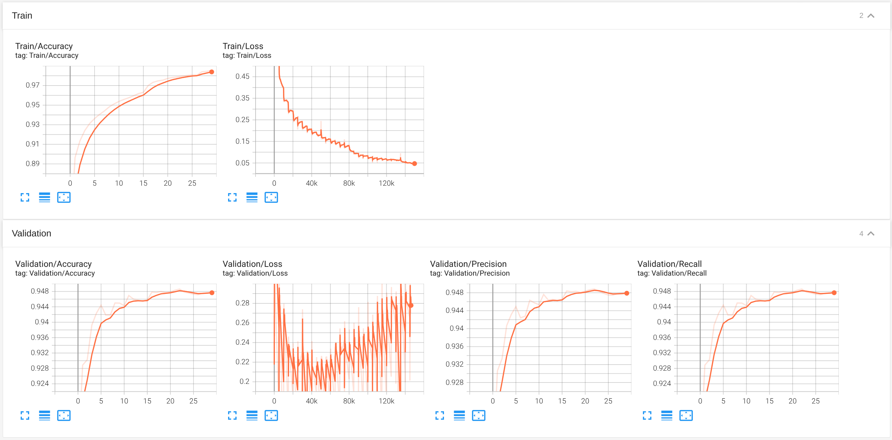
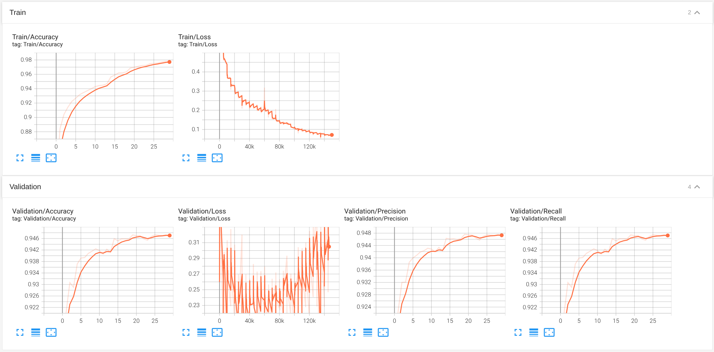

<h1 align="center">Hand-drawn Image Recognition</h1>

## Introduction

This is a hand-drawn image recognition project using Python, inspired by [Google's Quick, Draw!](https://quickdraw.withgoogle.com). The project allows users to draw in three different ways:

- **Drawing on canvas**: Users use the mouse to draw directly on the canvas window created by the program.

- **Drawing with camera and object**: Users use an object (such as a pen) to draw in space in front of the camera, the system will recognize the movement of this object to create a stroke.

- **Drawing with camera and hand**: Users use their own hand to draw in space in front of the camera, the system will recognize the movement of the finger to create a stroke.

After the user completes the drawing, the trained artificial intelligence model will predict that the drawing belongs to one of 20 pre-defined classes.

## Demo

<p align="center">
  <br/>
  <i>Canvas app demo</i>
</p>
</br>
<p align="center">
  <br/>
  <i>Camera app using marker app demo</i>
</p>
</br>
<p align="center">
  <br/>
  <i>Camera app using human hand app demo</i>
</p>

## Documentation

<details open>
<summary>Install</summary>

Clone the repository and install dependencies in a [**Python>=3.8.0**](https://www.python.org/) environment. Ensure you have [**PyTorch>=1.8**](https://pytorch.org/get-started/locally/) installed.

```bash
# Clone the repository
git clone https://github.com/TrinhKhaii/Hand-drawnImageRecognition.git

# Navigate to the cloned directory
cd Hand-drawnImageRecognition

# Install required packages
pip install -r requirements.txt
```

</details>

<details open>
<summary>Dataset</summary>

The training data for this project is sourced from [the Quick, Draw! dataset by Google](https://github.com/googlecreativelab/quickdraw-dataset), which contains 50 million hand-drawn sketches across 345 object categories contributed by users worldwide. For the purposes of this project, only 20 classes were selected to simplify the problem. The samples are utilized in the numpy bitmap format at a resolution of 28x28 pixels, facilitating efficient processing and model training for hand-drawn sketch recognition using Python.

The list of categories is as follows:

| Index | Class name | Index | Class name |
| :---: | :--------: | :---: | :--------: |
|   0   |   apple    |  10   |    door    |
|   1   | basketball |  11   |   flower   |
|   2   |    book    |  12   |   house    |
|   3   |   bowtie   |  13   |    key     |
|   4   | butterfly  |  14   |   knife    |
|   5   |   candle   |  15   |    moon    |
|   6   |    car     |  16   |  mountain  |
|   7   |   cloud    |  17   |  mushroom  |
|   8   |    cup     |  18   |    star    |
|   9   |  diamond   |  19   |  t-shirt   |

</details>

<details open>
<summary>Training</summary>

The model was trained using 10,000 samples per class, selected from 20 categories of the Quick, Draw! dataset. The dataset was partitioned into training and validation sets with a default ratio of 0.8, ensuring robust evaluation of model performance. Training results are presented in the figure below.

```bash
# Train the model with SGD optimizer
python src/train.py --optimizer sgd --learning_rate 0.01

# Train the model with ADAMW optimizer
python src/train.py --optimizer adamw --learning_rate 0.001

```

### Result:

| Epoch 30        | Train Loss | Train Accuracy | Val Loss | Val Accuracy | Val Precision | Val Recall | Best accuracy |
| --------------- | :--------: | :------------: | :------: | :----------: | :-----------: | :--------: | :-----------: |
| SGD optimizer   |   0.0469   |     0.9856     |  0.2748  |    0.9478    |    0.9480     |   0.9478   |    0.9486     |
| ADAMW optimizer |   0.0711   |     0.9783     |  0.3003  |    0.9470    |    0.9473     |   0.9470   |    0.9473     |

<p align="center">
  <br/>
  <i>Evaluation metrics using SGD optimizer</i>
</p>
</br>
<p align="center">
  <br/>
  <i>Evaluation metrics using ADAMW optimizer</i>
</p>

</details>

<details open>
<summary>Inference Usage</summary>

```bash
# Drawing on canvas
python -m canvas_app.draw --min-detect-area 3000 --prediction-display-time 3

# Drawing with camera and object
python -m camera_app.pointer_app --min-detect-area 3000 --pointer-color green

# Drawing with camera and hand
python -m camera_app.mediapipe_app --min-detect-area 3000
```

</details>

## References

[1] Inspired by [Quick, Draw! by Google](https://quickdraw.withgoogle.com/).  
[2] Inspired by [Viet Nguyen's QuickDraw GitHub](https://github.com/vietnh1009/QuickDraw/tree/master).  
[3] [Machine Learning cơ bản](https://machinelearningcoban.com/).  
[4] [Deeplearning cơ bản](https://nttuan8.com/sach-deep-learning-co-ban/).
